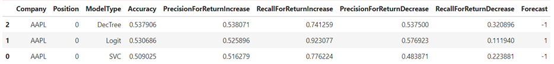
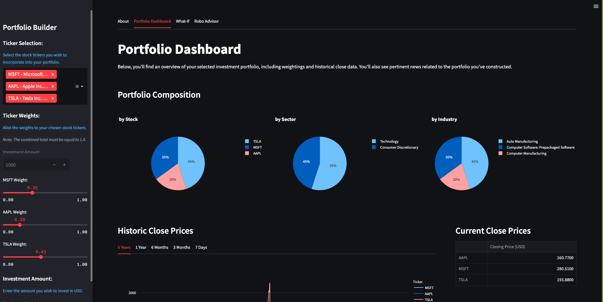
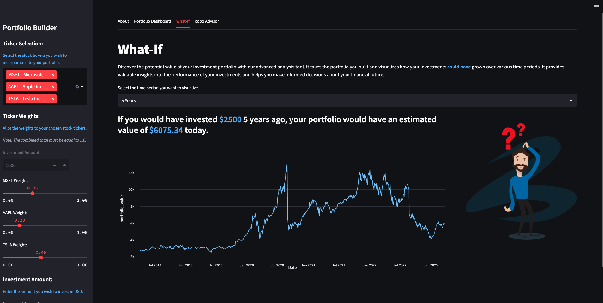
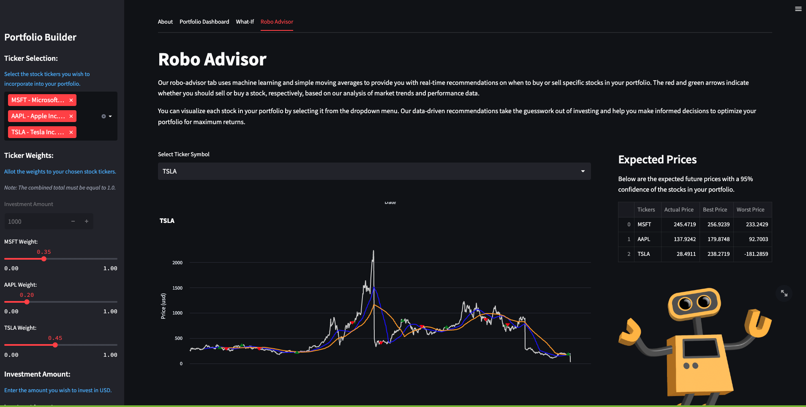
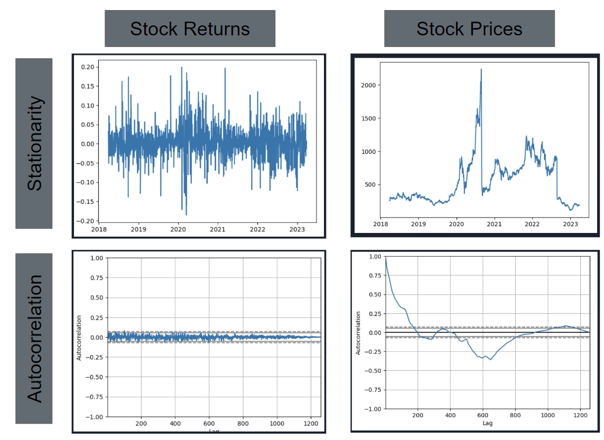

# ROBO ADVISOR


The team created a Trading Bot which allows the user to review stocks of their interest in terms of historical prices/resturns and recent news related to the stock, build pseudo portfolios, & receive trading recommendation based on DMAC algorithm for each equity. Although the archetypical bot is an illustration of how Machine Learning models can be integrated in trading algorithm there are risks associated with the predictions of stock returns generated by ML models and a careful assessment of risks associated with these recommendations is warranted. 

## Table of Contents
    1. Technologies
    2. Installation guide
    3. Usage
    4. Contributors
    5. License

## Technologies
`python 3.9`

`Visual Studio Code`

*Libraries*
`pandas` library provides easy to use data structure and data analysis tools for handling and manipulating tabular & time series data. 

`numpy` is a popular open-source Python library that provides support for large, multi-dimensional arrays and matrices, along with a wide range of mathematical functions to operate on them.

`streamlit` is an open-source Python library that allows users to create interactive web applications for data science and machine learning projects.

`python-dotenv` allows developers to load environment variables from a .env file into their Python applications. 

`alpaca_trade_api` provides a simple and easy-to-use interface for accessing the Alpaca brokerage platform's trading and account management services.

`dotenv` a popular third-party Python library that allows you to load environment variables from a .env file into your Python project.

`requests` is a popular third-party Python library that makes it easy to send HTTP/1.1 requests using Python

`plotly`  provides an interactive web-based graphical user interface for creating and sharing data visualizations

`prophet` provides an easy-to-use interface for fitting and making predictions with time series data using additive models

`finta` library is used for creating technical indicators on stock returns. 

`scikit-learn` library is used for various modeling methods (This is available with Anaconda)


## Installation Guide

In order to execute this program create a .env file and store the ALPACA key and ALPACA SECRET KEY in the local root directory.

In order to do this, create a .txt file in the root directory and save the keys in the document  
ALPACA_API_KEY= '************************'
ALPACA_SECRET_KEY= '************************************'
Once saved, update the extension of the file to .env.

To install numpy use
```python
pip install numpy
```

To install streamlit use
```python
pip install streamlit
```

To install plotly
```python
pip install plotly
```

To install requests library
```python
pip install requests
```

To install dotenv library
```python
pip install python-dotenv
```

To install finta library use 
```python
pip install finta
```

To check if scikit-learn is available in the environment
```python
conda list scikit-learn
```

If the terminal does not display scikit-learn use the command below to install the library
```python
pip install -U scikit-learn
```

## Usage

The front end of the application was developed using the `Streamlit` library. In the backend it extracts data using ALPACA APIs. It evaluates the expected returns using multiple machine learning models and selects the optimal model by comparing the performance of the models in terms of model accuracy, precision and recall. 



The result of the selected ML model is combined with a naive estimate of expected returns using performance of the stock over the last 30 days.  In the current version of the application, a price forecast is also generated using time series modeling and a final estimate of the expected price is made based on the comparison of the naive estimate and time series forecast. This expected price feds into the DMAC algorithm of the application which generates the trading signals for the next day.






## Limitations
At this point it is acknowledged that a time series modeling may not be an appropriate methodology for forecasting stock prices, although it has been included in the current version of the application. Stock prices are influenced by a wide range of factors, such as company performance, market trends, macroeconomic indicators, political events, and more. While historical stock prices provide some insight into past trends, these factors are constantly changing and evolving, making it challenging to accurately predict future prices using time series forecasting. Predicting stock returns using ML is also not free from risks, despite inclusion of several technical indicators from the `finta` library. 

The plots below highlight the limitation of timeseries forecast for stock prices


The team also researched another popular forecasting methodology called ARIMA modeling- AutoRegressive Integrated Moving Average. The successful use of ARIMA modeling depends on the time series data meeting certain key assumptions like linear relationship between the current value of the variable with it's lagged value, stationarity of the series overtime and a linear relation between current value and past forecast errors. The nature of the time series is defined in terms of hyperparameters that is associated with each of the base assumptions. It is worth noting that a generalized approach to forecasting prices of all stocks using a fixed set of parameters is bound to reult in inaccuracies.

The plot below illustrate the plots associated with stationarity and auto-correlation in time-series.



 for the code used to explore ARIMA

## Next Steps
Future application updates will include
- Enhancements to portfolio dashboard to include company financial attributes
- Key events calendar
- Application runtime efficiency
- Live trading functionality

---

## Contributors

Adam Jiminez 
Vincent Sgarzi 
Baha Amour 
Kunal Srinivasan 

---

## License

Columbia University, Fintech Bootcamp 2023
